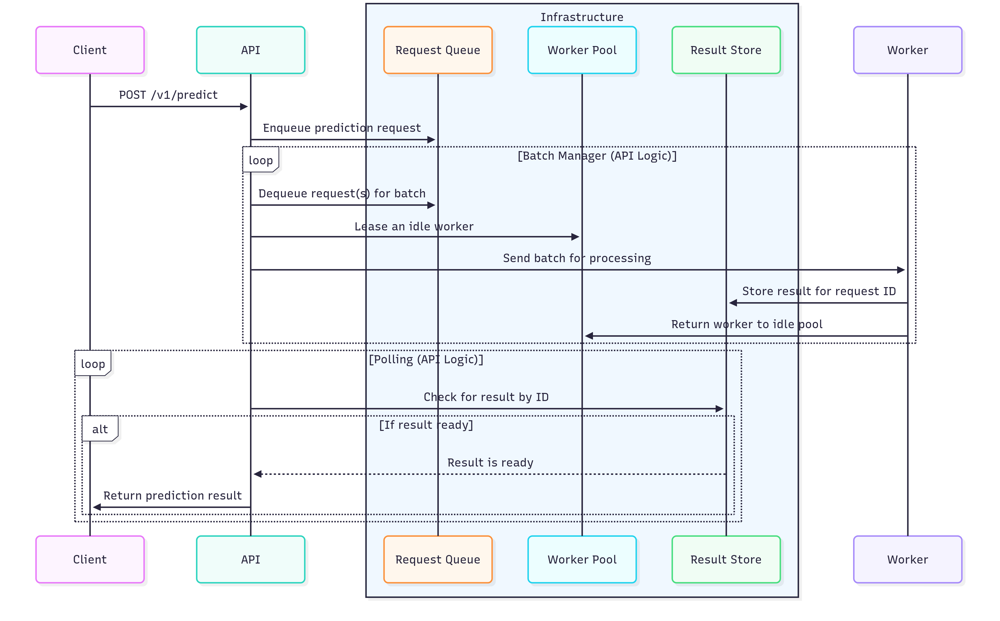

# VLM-GPT: High-Performance LLM Serving Gateway

A scalable, containerized API gateway for local LLMs (GGUF models) with efficient batching, FastAPI, Redis, and Docker.

**Key Features:**
- **Batching** maximizes throughput
- **Redis** manages queues and worker states  
- **Docker** enables easy scaling
- **Multimodal** text+image support
- **GPU acceleration** with CUDA

## System structure


*Figure: High-level architecture (API layer, Redis, worker pools, GPU nodes).*

```
                    LOAD BALANCER
                          │
        ┌─────────────────┼─────────────────┐
        │                 │                 │
        ▼                 ▼                 ▼
   API INSTANCE 1    API INSTANCE 2    API INSTANCE N
   (Port 8000)       (Port 8001)       (Port 800N)
        │                 │                 │
        └─────────────────┼─────────────────┘
                          │
                    REDIS CLUSTER
                          │
        ┌─────────────────┼─────────────────┐
        │                 │                 │
        ▼                 ▼                 ▼
   WORKER POOL 1     WORKER POOL 2     WORKER POOL N
   ┌─────────────┐   ┌─────────────┐   ┌─────────────┐
   │ Worker 1.1  │   │ Worker 2.1  │   │ Worker N.1  │
   │ Worker 1.2  │   │ Worker 2.2  │   │ Worker N.2  │
   │ Worker 1.M  │   │ Worker 2.M  │   │ Worker N.M  │
   └─────────────┘   └─────────────┘   └─────────────┘
        │                 │                 │
        ▼                 ▼                 ▼
    GPU NODE 1        GPU NODE 2        GPU NODE N
```

## Performance Benchmarksss

The system has been tested with comprehensive benchmarks designed for a 2-worker configuration:

### System cofigurations
- 2-worker setup
- 16GB Memory used
- GPU [ Nvidia RTX 3070 ]

### Benchmark Results Overview for Gemma-3 4B

| Test Case | Duration | Requests | Success Rate | RPS | Avg Latency | P95 Latency | Tokens/s |
|-----------|----------|----------|--------------|-----|-------------|-------------|----------|
| Burst Load (10req/1s) | 29.6s | 10 | 100% | 0.34 | 27.5s | 29.5s | 27.1 |
| Sustained Load (2req/s×15s) | 253.2s | 30 | 100% | 0.12 | 14.8s | 27.2s | 17.5 |
| Ramp-up Load (1→8req/s) | 311.8s | 64 | 100% | 0.21 | 19.4s | 38.3s | 30.1 |
| Stress Test (20 concurrent) | 63.4s | 20 | 100% | 0.32 | 38.4s | 63.4s | 38.4 |

**Test Case Details:**
- **Burst Load Test**: Sends 10 requests simultaneously within 1 second to test burst handling capacity and initial system responsiveness
- **Sustained Load Test**: Maintains steady 2 requests/second for 15 seconds to evaluate consistent performance under optimal worker utilization  
- **Ramp-up Load Test**: Gradually increases from 1 to 8 requests/second over 15 seconds to identify throughput scaling behavior and saturation points
- **Stress Test**: Launches 20 concurrent requests simultaneously to test system limits, queue handling, and error recovery under extreme load

### Key Performance Insights

- **System Reliability**: 100% success rate across all test scenarios
- **Burst Handling**: Efficiently processes 10 simultaneous requests with 27.5s average latency
- **Sustained Performance**: Maintains stable 14.8s average latency under steady 2 req/s load
- **Scaling Behavior**: Handles gradual load increases up to 8 req/s with graceful performance degradation
- **Stress Resilience**: Successfully processes 20 concurrent requests without failures
- **Token Generation**: Peak performance of 38.4 tokens/second under stress conditions
